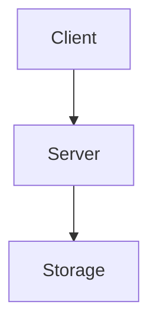
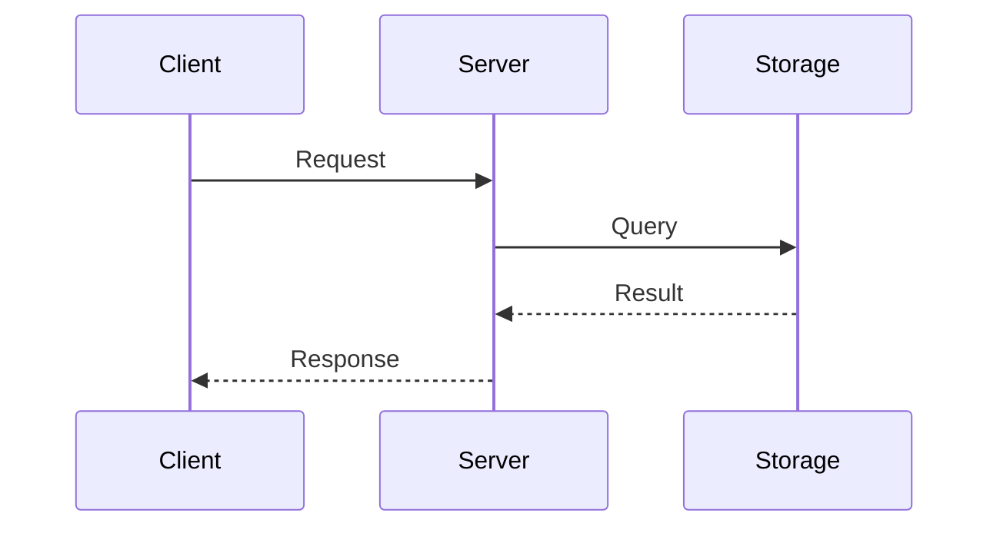

# Reverse Proxy — Architecture

## Overview

_TODO: describe what this system does and the core design decisions._

## Component Diagram

## Sequence Diagram

## Data Flow

_TODO: describe how data moves through the system._

## Key Design Decisions

| Decision | Rationale |
|----------|-----------|
| _TODO_ | _TODO_ |
