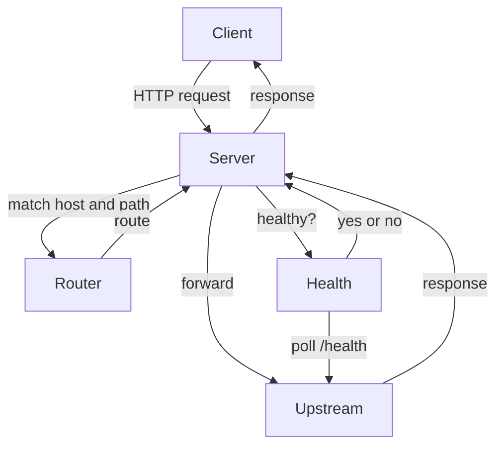
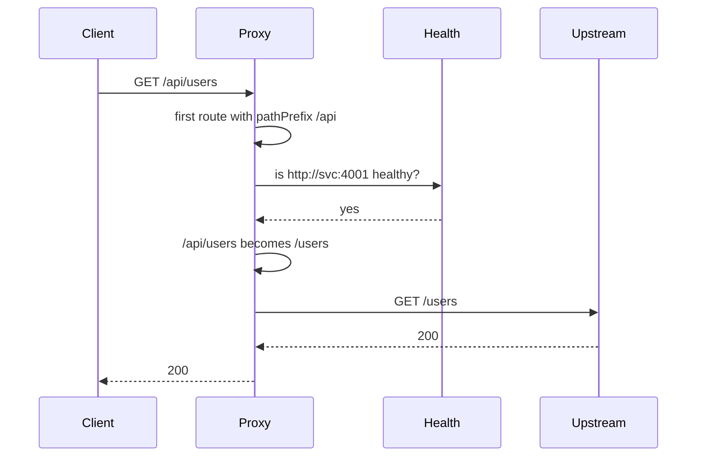

# Architecture

The proxy is one Node.js process. It reads a JSON config, listens for HTTP, and forwards each request to the first matching backend.



## A request

1. If the path is under `/_proxy/`, the management API handles it. It is never forwarded.
2. Otherwise the router walks the route list from top to bottom and returns the first match.
3. No match returns `404 Not Found`.
4. If that upstream has a health check and the last probe failed, the proxy returns `502 Bad Gateway` and does not call the backend.
5. The proxy strips hop-by-hop headers, applies the route's header rules, and streams the body to the upstream.
6. The upstream status and body are streamed back. Response header rules are applied the same way.



## Routing

A route matches only when every condition it sets is true.

| Condition | Rule |
|-----------|------|
| `match.host` | Case-insensitive. `app.local` matches `App.Local` and `app.local:3000`. If the config includes a port, the port must match too. |
| `match.pathPrefix` | The path must start with this string. `/api` matches `/api`, `/api/users`, and also `/apiv2`. |

Both can be set. Then the host and the path must match.

`stripPrefix` removes that prefix and always leaves a path that starts with `/`. `/api/users` with prefix `/api` becomes `/users`. `/api` becomes `/`. If the upstream URL has its own path, such as `http://svc:4001/base`, the request path is appended: `/base/users`.

The query string is forwarded unchanged.

## Headers

These hop-by-hop headers are removed from the request and the response. They describe the current connection and must not be passed on:

`connection`, `keep-alive`, `proxy-authenticate`, `proxy-authorization`, `te`, `trailer`, `transfer-encoding`, `upgrade`

Any header named in the `Connection` header is removed too. `content-length` is kept so the body framing stays intact.

After that, the route can:

- `addRequestHeaders` / `removeRequestHeaders` on the way to the upstream
- `addResponseHeaders` / `removeResponseHeaders` on the way back to the client

If a name is both added and removed, it stays removed. The `Host` header sent upstream is the upstream host, not the client's host.

## Health checks

Each route with `healthCheck` polls `upstream + path` on a timer. `intervalMs` defaults to 10 seconds. Each probe gives up after 5 seconds.

- `200`–`299` marks the upstream healthy.
- Any other status, a timeout, or a connection error marks it unhealthy.
- Until the first probe finishes, the upstream is treated as healthy.
- Two routes that use the same upstream share one poller. The poller stops when the last of those routes is removed.
- A route with no `healthCheck` is always treated as healthy.

`GET /_proxy/health` returns:

```json
{ "status": "healthy", "routes": { "http://127.0.0.1:4001": true } }
```

`status` is `unhealthy` when any watched upstream is unhealthy. Routes without a health check do not appear in `routes`.

## Errors

| Status | When |
|--------|------|
| 400 | The request target is not a normal path, or a management body is invalid. |
| 404 | No route matches, or `DELETE /_proxy/routes/:index` names a missing index. |
| 502 | The upstream is unhealthy, or the connection fails. |
| 504 | The upstream accepts the connection but does not respond within 30 seconds. |
| upstream status | The backend answered. A `500` from the backend is passed through. |

## Management API

| Method | Path | What it does |
|--------|------|----------------|
| GET | `/_proxy/routes` | List routes in order. Each item includes `index` and `isHealthy`. |
| POST | `/_proxy/routes` | Append a route. Returns `201` and the stored route. |
| DELETE | `/_proxy/routes/:index` | Remove that index. Returns `204`. Later indexes shift down. |
| GET | `/_proxy/health` | Overall status and one boolean per watched upstream. |

Adding or removing a route does not restart the process. The new list is used by the next request.

## Files

| File | Role |
|------|------|
| `src/bin/server.ts` | Reads the config path, listens, stops on SIGINT and SIGTERM. |
| `src/config.ts` | Loads JSON and checks routes, upstreams, and the listen address. |
| `src/server.ts` | HTTP server. Management routes, then proxying. |
| `src/router.ts` | Match order, host comparison, prefix stripping, route list. |
| `src/headers.ts` | Hop-by-hop removal and per-route header changes. |
| `src/health.ts` | One background probe per upstream. |
| `src/proxy.ts` | Opens the upstream request and pipes both bodies. |
| `src/respond.ts` | Plain-text errors, JSON replies, and reading a JSON body. |

Shutdown stops the health timers and closes open connections.
